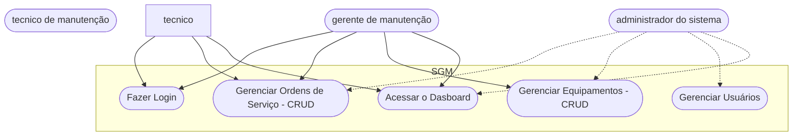

# Sistema de Getão de Manutenção (SGM) - Formativa

## Briefing
O projeto consiste no desenvolvimento de um Sistema de Gestão de Manutenção (SGM) no formato de uma aplicação web. O objetivo é centralizar e otimizar o controle das atividades de manutenção de máquinas e equipamentos de uma empresa. A plataforma permitirá o cadastro de equipamentos, agendamento de manutenções preventivas e corretivas, e o gerenciamento de ordens de serviço.

## Objetivos do Projeto
- gerenciar informações sobre equipamentos e manutenção de uma empresa
- realizar abertura de chamados de manutenção (ordens de serviço)
- visualizar informaçoes em um dashboard

## Público-Alvo
- Técnicos (usuário final) - Ordens de Serviço
- Gerentes (usuário intermediário) - Ordens de Serviço / Equipamentos
- Admin dos Sistema - Responsável pelo Gestão de Usuários

## Levantamento de Requistos do Projeto
- ### Requisitos Funcionais
    - Gerenciamento de Ordens de Serviço (Criar, Atualizar, Listar, Deletar)
    - Gerenciamento de Usuário pelo Admin (Criar, Atualizar, Listar , Deletar)
    - Gerenciamento de Equipamentos (Criar, Atualizar, Listar, Deletar) 
    - Tela de Visualizações de Informações de Acordo com o Perfil do Usuário
    - Tela de Login dos Usuários (Email e Senha)

- ### Requisitos Não Funcionais
    - Armazenamento das Informações sobre Ordem de Serviço, Equipamento e Usuários em um BD (MongoDB)
    - Criptografia de Senha do Usuário 
    - JWT para Segurança das Conexões
    - Gerenciamento de Rotas de Acesso (Middlewares)

## Recurso do Projeto (Tecnológicos)
- Framework de Desenvolvimetno Next
- MongoDB (Banco de Dados - Não Relacional)
- Linguagem de Programação : TypeScript
- GitHub
- VsCode
- Figma

## Diagramas

1. ### Classe
Descreve o Comportamento das Entidades do Sistema
- Usuários (User/Usuario)
    - Atributos: id, nome, email, senha, função
    - Métodos: create, read, update, delete, login, logout

- Equipamentos (Equipment/Equipamento)
    - Atributos: id, modelo, marca, descricao, status, localizacao, numeroSerie
    - Métodos: CRUD

- Ordem de Serviço (ServiceOrder/OrdemServico)
    - Atributos: id, titulo, descricao, tipo, status, idTecnico, idEquipamento
    - Métodos: CRUD

2. ### Caso de Uso
Ilustra as interações dos diferentes tipos de usuários(Atores) com as funcionalidades do sistema
- Técnico: Gerenciar Ordem de Serviço (CRUD) e acessar o DashBoard
- Gerente: funções do técnico + Gerenciamento de Equipamentos (CRUD)
- Admin: Gerenciar Usuários, Acessar o Dashboard

Todos Devem Fazer o login antes de qualquer ação

